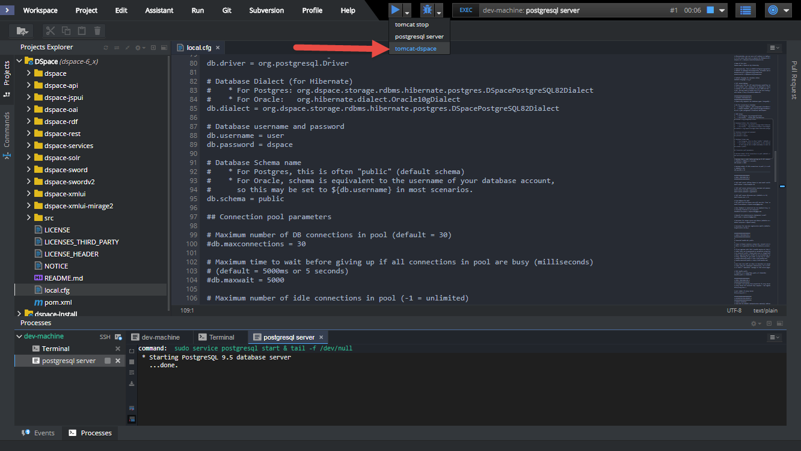
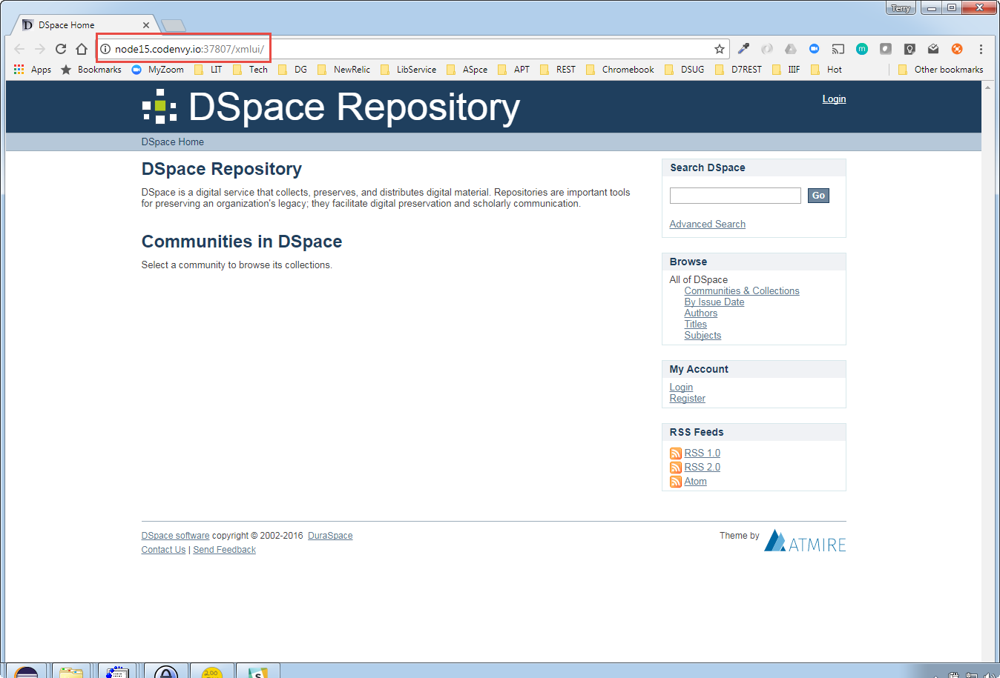

## Goal

Explore [Codenvy](http://codenvy.io) as a development and testing environment for DSpace Contributors.

Codenvy servers stay alive through 10 min of activity in unpaid accounts.  Servers associated with a paid account stay alive for 4 hours.

## Assumptions

Based on experience, a default Codenvy server with 2GB of RAM fails when building on DSpace.

I have tested with a 4GB Codenvy server.

I have not tested a 3GB workspace if the free tier.  If 3GB is sufficient, this would be useful.

## Docker File

The following [Dockerfile](Dockerfile) has been used for testing.

## Codenvy Setup Process

### Stack Creation

- Create a Stack -> "Build Stack from Recipe"
- Use the Dockerfile referenced above
- Name the Stack "aadspace"
- Set the Runtime workstation to 4GB

### Workspace Creation

- create a workspace
- choose "Single Machine" and select the Stack "aadspace"
- name the workspace "dspace"
- launch the workspace

## Post Docker Setup Tasks

The database needs to be configured.  Codenvy seems to default to a user of "user".  Since "user" is a keyword in postgres, it can be a little tricky to configure.

Create postgres user

    sudo -u postgres createuser user

Create the database

    sudo -u postgres psql
        create database dspace;
        grant all on database dspace to "user";
        alter user "user" with password 'dspace';

Add pgcrypto to database

    sudo -u postgres psql -d dspace
        create extenstion pgcrypto;        

## Clone DSpace (dspace-6_x)

Clone DSpace into /projects

Create /projects/dspace-install

## Create local.cfg

Change postgres user to "user".  Set install dir to /projects/dspace-install.

    [local.cfg](local.cfg)

    
    
## Build Code

- mvn package
- ant install

### Create webapps symlinks

    cd ~/tomcat8/webapps
    ln -s /projects/dspace-install/webapps/xmlui xmlui
    ln -s /projects/dspace-install/webapps/jspui jspui
    ln -s /projects/dspace-install/webapps/oai oai
    ln -s /projects/dspace-install/webapps/rest rest

## Codenvy Runtime Configs

### Start postgres server

Run

    sudo service postgresql start & tail -f /dev/null

    

### Start tomcat8

Run

    ~/tomcat8/bin/catalina.sh run

Preview

    http://${server.port.8080}/xmlui

    

### Stop tomcat8

Run

    ~/tomcat8/bin/catalina.sh stop

## Accessing the URL for DSpace

Now that tomcat is running, a link to the publicly available URL for DSpace will be exposed.

    

Click the link to open (and share) your DSpace instance

    

