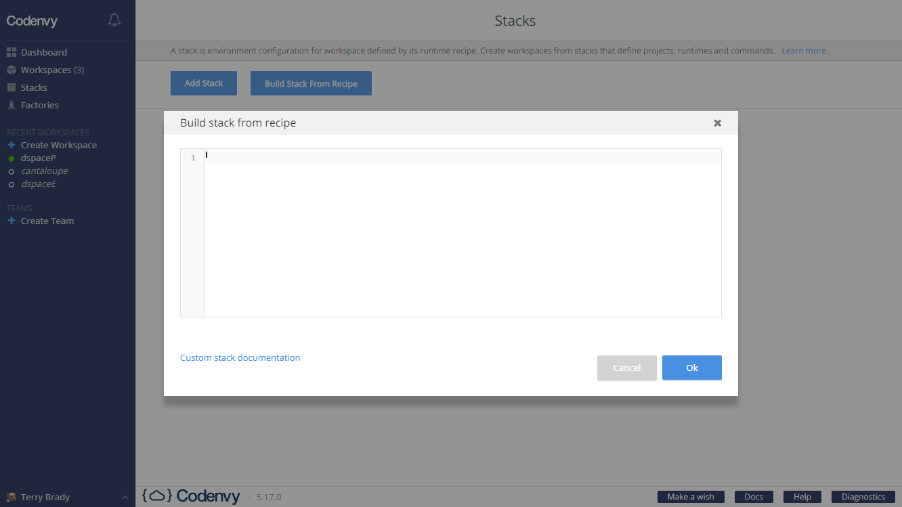
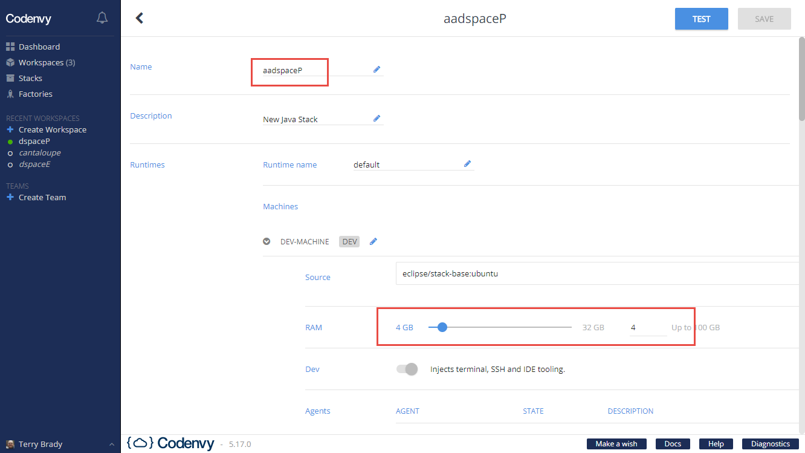
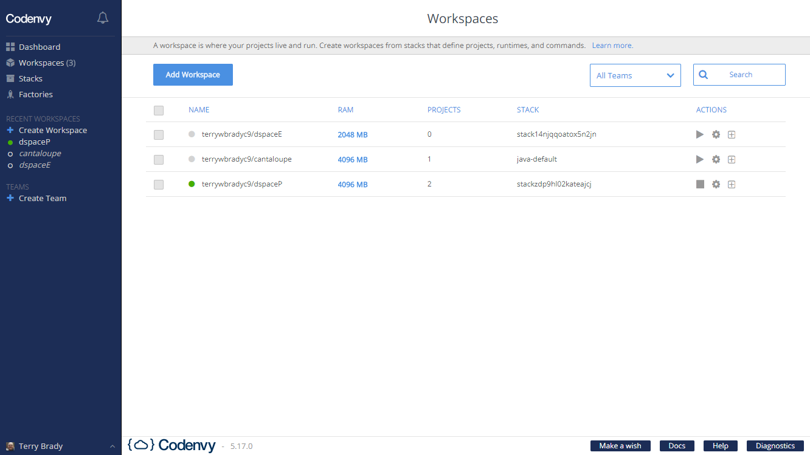
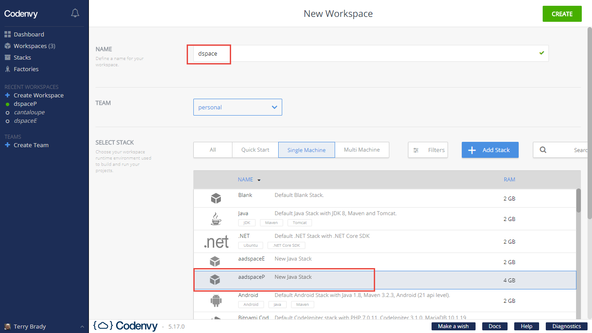
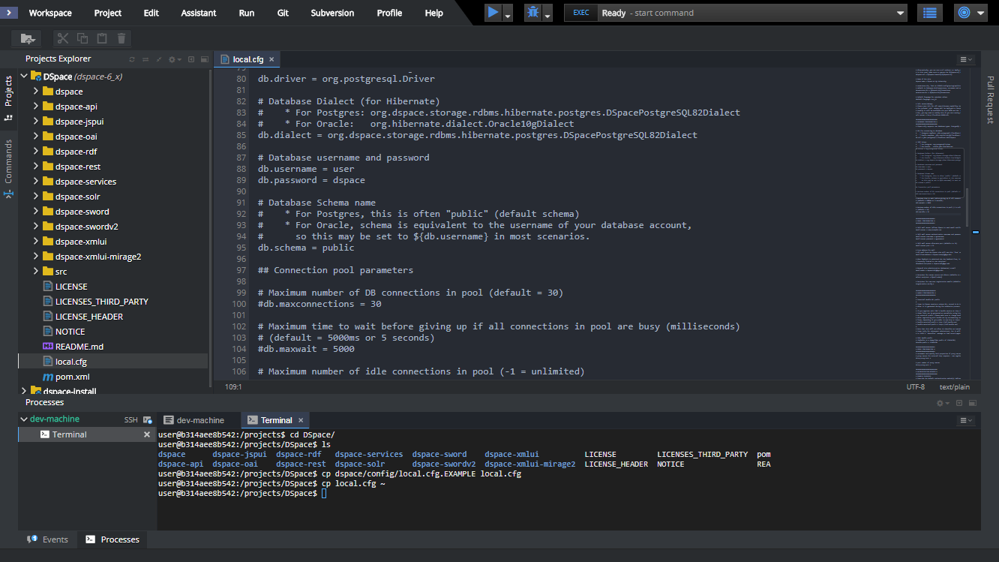
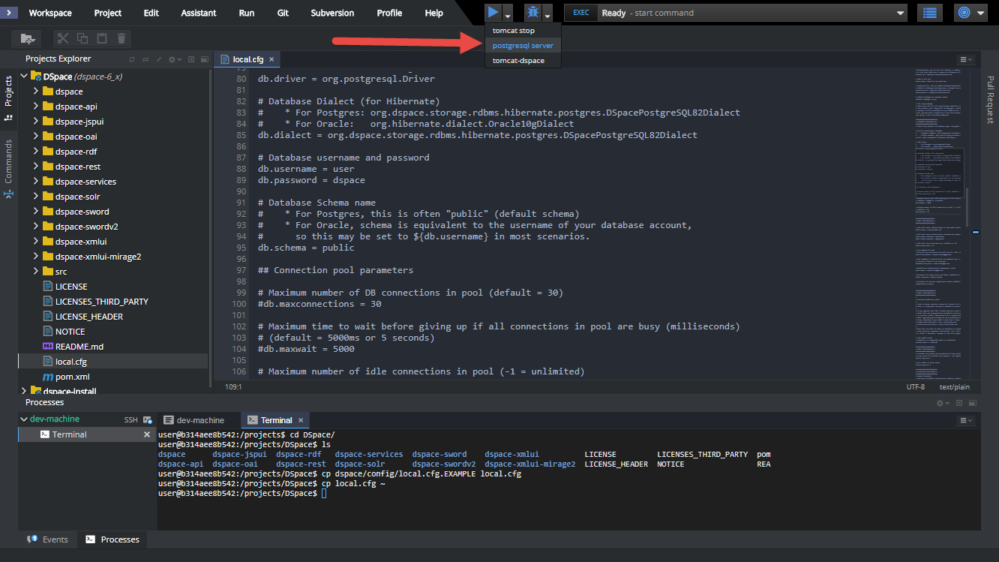
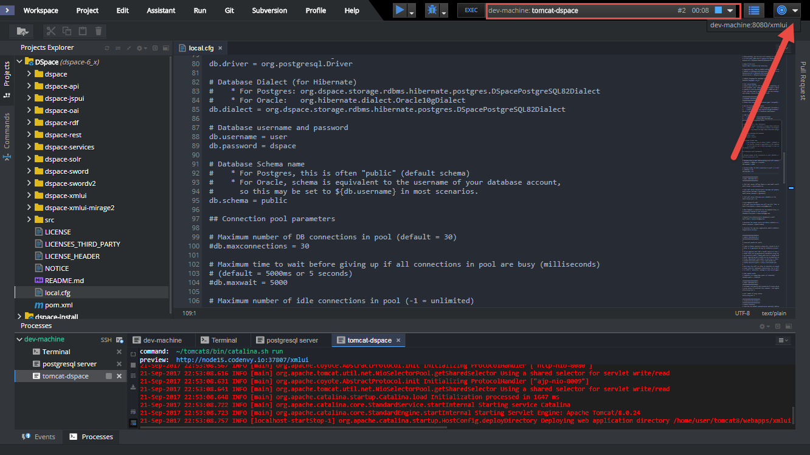

## Goal

Explore [Codenvy](http://codenvy.com) as a development and testing environment for DSpace Contributors.

Codenvy servers stay alive through 10 min of activity in unpaid accounts.  Servers associated with a paid account stay alive for 4 hours.

## Assumptions

Based on experience, a default Codenvy server with 2GB of RAM fails when building on DSpace.

I have tested with a 4GB Codenvy server.

I have not tested a 3GB workspace if the free tier.  If 3GB is sufficient, this would be useful.

## Docker File

The following [Dockerfile](Dockerfile) has been used for testing.

The following [Workspace Config](workspace.json) could be useful in replicating this setup.  (RAM has been set to 3GB)

## Codenvy Setup Process

### Stack Creation

- Create a Stack -> "Build Stack from Recipe"
- Use the Dockerfile referenced above
- Name the Stack "aadspace"
- Set the Runtime workstation to 4GB

    

    

### Workspace Creation

- create a workspace
- choose "Single Machine" and select the Stack "aadspace"
- name the workspace "dspace"
- launch the workspace

    

    

## Post Docker Setup Tasks

The database needs to be configured.  Codenvy seems to default to a user of "user".  Since "user" is a keyword in postgres, it can be a little tricky to configure.

Create postgres user

    sudo -u postgres createuser user

Create the database

    sudo -u postgres psql
        create database dspace;
        grant all on database dspace to "user";
        alter user "user" with password 'dspace';

Add pgcrypto to database

    sudo -u postgres psql -d dspace
        create extenstion pgcrypto;        

## Clone DSpace (dspace-6_x)

Clone DSpace into /projects

Create ~/dspace-install

## Create local.cfg

Copy DSpace/dspace/config/local.cfg.EXAMPLE to DSpace/local.cfg

Make the following changes
- https://github.com/terrywbrady/dspace-on-codenvy/blob/master/local.cfg#L31
- https://github.com/terrywbrady/dspace-on-codenvy/blob/master/local.cfg#L88

Codenvy seems to perform some unexpected git refreshes.

    

Copy DSpace/local.cfg to ~/local.cfg in case you need to recreate it.
    
## Build Code

### Maven Build

    cp ~/local.cfg /projects/DSpace
    mvn clean package -f ${current.project.path}

### DSpace Install
Start postgres first!

    ant -f ${current.project.path}/dspace/target/dspace-installer/build.xml update

### Create webapps symlinks

    cd ~/tomcat8/webapps
    ln -s ~/dspace-install/webapps/xmlui xmlui
    ln -s ~/dspace-install/webapps/jspui jspui
    ln -s ~/dspace-install/webapps/oai oai
    ln -s ~/dspace-install/webapps/rest rest
    ln -s ~/dspace-install/webapps/solr solr

## Codenvy Runtime Configs

### Start postgres server

Run

    sudo service postgresql start & tail -f /dev/null

    

### Start tomcat8

Run

    ~/tomcat8/bin/catalina.sh run

Preview

    http://${server.port.8080}/xmlui

    

### Stop tomcat8

Run

    ~/tomcat8/bin/catalina.sh stop

## Accessing the URL for DSpace

Now that tomcat is running, a link to the publicly available URL for DSpace will be exposed.

    

Click the link to open (and share) your DSpace instance

    

## Next Steps

### Dockerfile TODOs

- Add Mirage2 dependencies to Dockerfile
- Automate database setup and other post install setup to Dockerfile
- Find a larger filesystem that /home/user.  Build a dspace-install folder on that file system.
  - See https://codenvy.io/docs/getting-started/volume-mounts/index.html
- Build local.cfg in Dockerfile
- Fix issue requiring a manual restart of postgres on startup
  
### DSpace Configuration  
  
- Evaluate platform for contribution work
  - How good is Che as an editor when working with the DSpace code base?
  - How effective is Codenvy for PR testing/evaluation?
- Build a sharable workspace config for DSpace that automatically clones DSpace
  - Tom Desair has done something like this for DSpace 7: http://bit.ly/dspace-ng-ide-v0_1
- Understand Codenvy [team account](https://codenvy.io/docs/user-guide/teams/index.html) costs and features
  - I sent a request to the vendor asking for more pricing information, but I have not received a response
  - https://codenvy.com/product/index.php#pricing

## Unexpected behaviors

* Changes made to /projects/DSpace/local.cfg are lost each time the server is restarted.  The server seems to refresh from git on restart.
  * I suspect that this is because local.cfg is in .gitignore.  The build script has been modified to pull local.cfg from /home/user.
* User "user" is able to write to /projects and to /home/user.  There is more space in /projects.  But, if the dspace-install dir is placed under /projects, the IDE (che) becomes unstable.  See not above about the install dir.
* The DSpace REST api is inaccessible from Codenvy using this configuration
